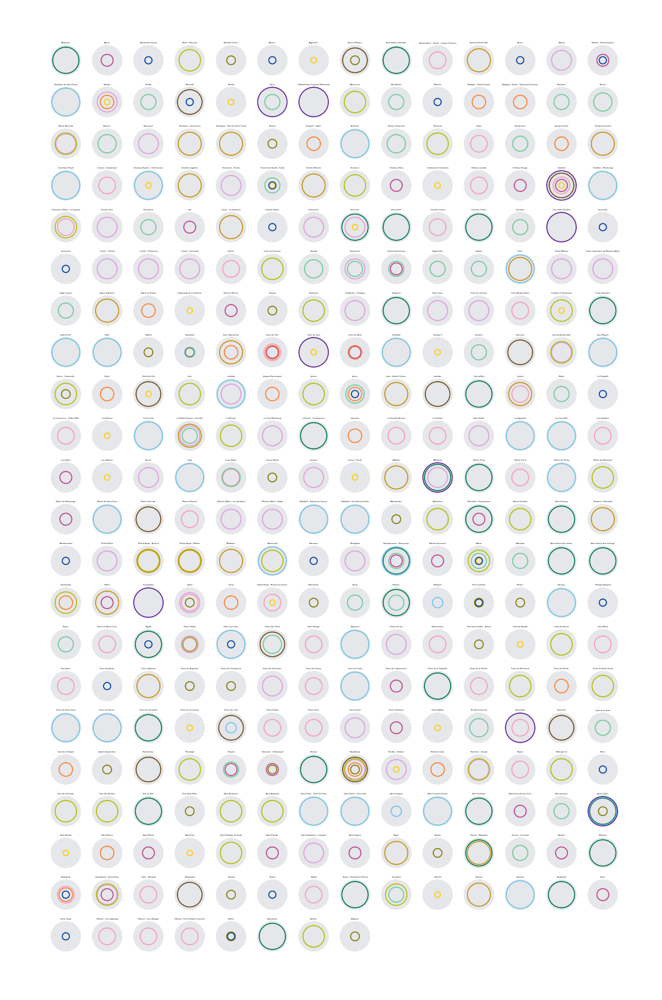

# Visualizing the Paris Subway Network

This project builds a small-multiple visualization of the Paris subway network.

You can read more about this project [here](https://www.rand-on.com/datascience/2018_paris_subway/paris_subway.html).

Here is a low-res version of the output. Each point is a subway station.
Each circle is a subway line (color is official line color and circle
size is proportional to line number)



You should download the code and run it yourself to get a higher image
resolution or a .pdf output.

# Running the code

Requires Python > 3.3.

```
$ git clone https://github.com/BenjaminHabert/Paris_Subway_Dataviz.git
$ cd Paris_Subway_Dataviz
$ make install
$ make pipeline
```

## Pipeline steps

- get the list of stations and lines from [wikipedia](https://fr.wikipedia.org/wiki/Liste_des_stations_du_m%C3%A9tro_de_Paris)
- for each line: get the color of the line by looking at the proper div in
it's [own wikipedia page](https://fr.wikipedia.org/wiki/Ligne_9_du_m%C3%A9tro_de_Paris)
- create image from the collected dataset

Intermediate (.csv files) and final (.png and .pdf images) are stored in data/
and are not committed to the repository.
